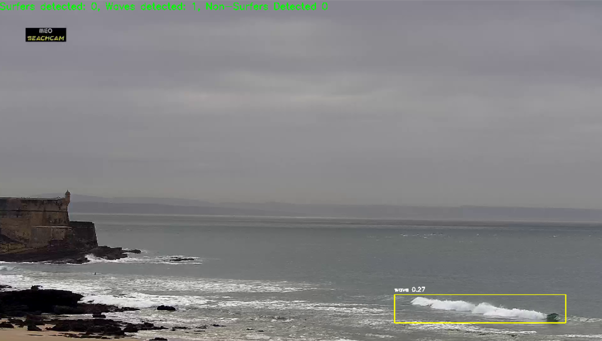

# Real-Time Surf Detection

A YOLOv8 model fine-tuned to detect surfers, non-surfers, and waves in real-time from beach camera feeds, with the option to automatically record surf sessions.

## Overview

This project uses computer vision to analyze live beach camera streams and identify surfing activity. The model can detect three classes of objects: surfers actively riding waves, people in the water who aren't surfing, and the waves themselves.



*Wave detected with confidence score of 0.27*


## Features

- Real-time detection from webcam or video streams
- Classification of surfers, non-surfers, and waves
- Automatic session recording when surf activity is detected
- Built on YOLOv8 for fast inference

## Current Limitations

The model was trained on only 100 annotated images, which means:
- Detection accuracy can be improved with more training data
- Performance may vary across different beach locations and lighting conditions
- False positives and missed detections are possible

Future improvements will include expanding the training dataset and fine-tuning the model parameters.

## Installation

```bash
# Clone the repository
git clone https://github.com/MoritzMueller02/real-time-surf-detection.git
cd real-time-surf-detection

# Install dependencies
uv sync
```

## Usage

Run the detection application:

```bash
python app.py
```

The application will start processing the video feed and display detected objects with bounding boxes and confidence scores.

## License

This project is licensed under CC0 1.0 Universal.

## Contributing

Contributions are welcome, especially additional training data from different surf locations. Please feel free to submit issues or pull requests.